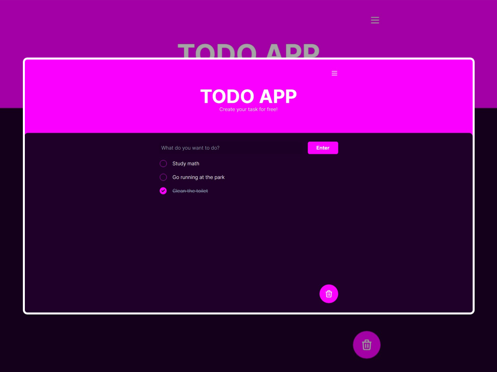
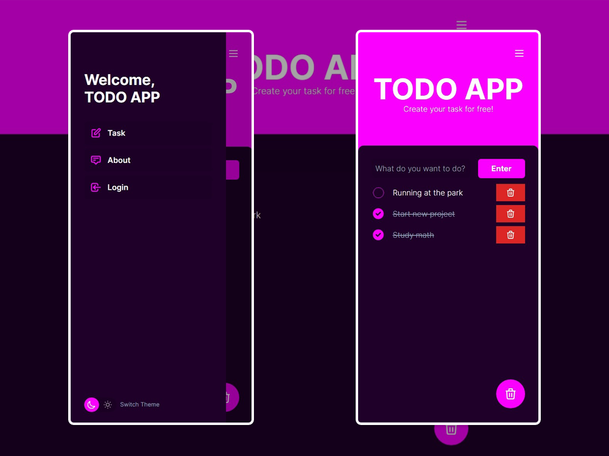
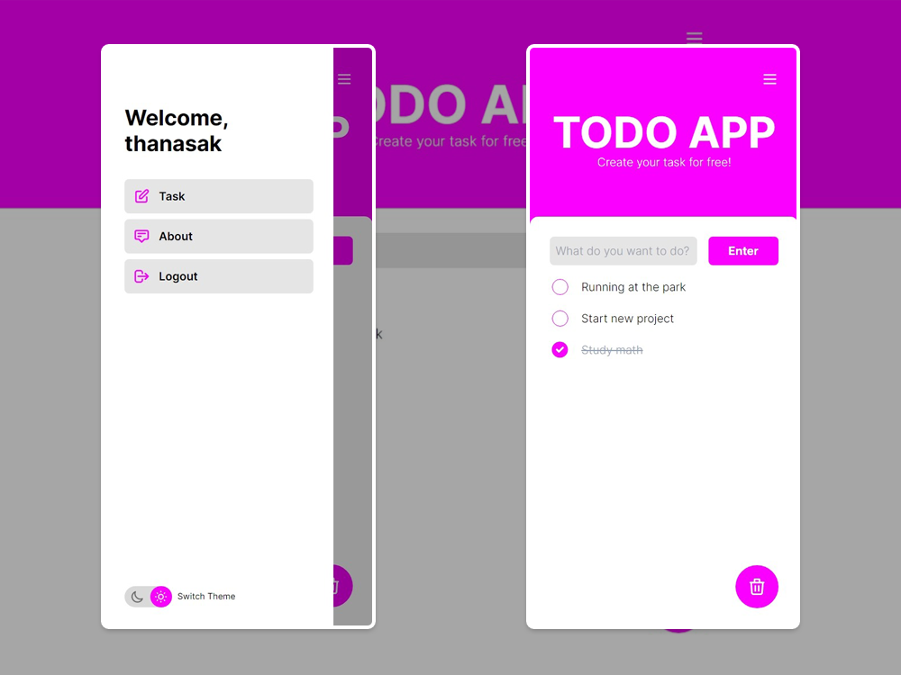

# React-Todo-App

A todo web application allows users to add and delete their todo task.
This project also includes a Theme switching function with Tailwind
and an [Authentication API](https://github.com/Dope21/authentication-api) with Node, Express, JWT and MySQL.

## Live : [https://tnk-todo-app.netlify.app/](https://tnk-todo-app.netlify.app/)

## Stack

- [React.js](https://reactjs.org/) - A JavaScript library for building user interfaces.
- [Tailwind CSS](https://tailwindcss.com/) - A utility-first CSS framework for rapidly building custom user interfaces.
- [Node.js](https://nodejs.org/) - A Back-end JavaScript runtime environment
- [Express](https://expressjs.com/) - A Node.js framework for building web app and API
- [JWT](https://jwt.io/) - JSON Web Token for Authentication
- [MySql](https://www.mysql.com/) - A relational database management system based on SQL.

## Features

- `Todo List` - add or delete todo task and re-order complete task to the bottom.
- `Dark/Light Theme` - toggle between two themes and save user preferences for initial theme.
- `Login & Register` - you don't need to have an account for this app but you can try this feature.
- `Authentication` - user login automatically until token expire or logout.

## Design

